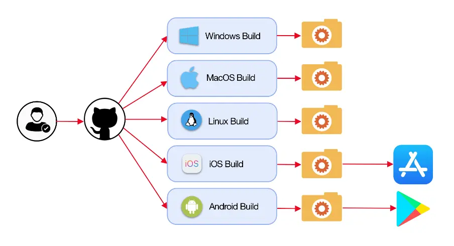

# 📱 End-to-End CI/CD Pipeline com GitHub Actions para Aplicação Android



---

## 📌 Sobre o Projeto

Este projeto demonstra a implementação de um pipeline completo de CI/CD utilizando GitHub Actions para automatizar o build, teste e geração de artefatos de uma aplicação Android.

A solução simula um ambiente real de desenvolvimento mobile, aplicando práticas modernas de DevOps para garantir integração contínua, validação automatizada e entrega padronizada de builds.

---

# 🏗️ Arquitetura da Solução

A arquitetura do pipeline é composta pelas seguintes etapas:

## 1️⃣ Integração Contínua (CI)

- Trigger automático a cada push ou pull request
- Checkout do código-fonte
- Configuração do ambiente Java
- Instalação do Android SDK
- Execução de build automatizado
- Execução de testes unitários
- Validação de integridade do projeto

## 2️⃣ Entrega Contínua (CD)

- Geração do APK
- Upload do artefato como build artifact
- Controle de versão
- Possibilidade de integração futura com Play Store

---

# 🧠 Decisões Arquiteturais

- Uso do GitHub Actions para integração nativa com o repositório
- Pipeline declarativo via YAML
- Separação clara entre etapas de build e testes
- Automação completa sem intervenção manual
- Versionamento centralizado no GitHub
- Execução em runners Linux para otimização de performance

---

# ⚙️ Stack Tecnológica

- GitHub Actions
- Java (JDK 11 ou superior)
- Android SDK
- Gradle
- Git
- YAML (workflow definition)

---

# 📂 Estrutura do Projeto

- `.github/workflows/android-ci.yml` → Pipeline principal
- `app/` → Código-fonte da aplicação
- `build.gradle` → Configuração do build
- `gradle/` → Configurações do wrapper
- `settings.gradle` → Configuração global do projeto

---

# 🚀 Funcionamento do Pipeline

## 🔹 1️⃣ Trigger

O pipeline é acionado automaticamente em:

- Push para branch principal
- Pull Requests
- Atualizações de código

---

## 🔹 2️⃣ Setup do Ambiente

Etapas automatizadas:

- Checkout do repositório
- Configuração do Java
- Instalação do Android SDK
- Permissão de execução do Gradle

---

## 🔹 3️⃣ Build do Projeto

```bash
./gradlew build
```

Essa etapa compila o código e valida dependências.

---

## 🔹 4️⃣ Execução de Testes

```bash
./gradlew test
```

Garante que alterações não quebrem funcionalidades existentes.

---

## 🔹 5️⃣ Geração do APK

```bash
./gradlew assembleDebug
```

O APK gerado é armazenado como artefato no GitHub Actions.

---

# 📦 Artefatos Gerados

- APK Debug
- Relatórios de testes
- Logs de execução do pipeline

Os artefatos podem ser baixados diretamente da aba "Actions" do repositório.

---

# 🔐 Boas Práticas Implementadas

✔ Integração contínua automatizada  
✔ Validação automática de código  
✔ Pipeline declarativo versionado  
✔ Execução isolada em ambiente controlado  
✔ Entrega padronizada de builds  
✔ Preparado para expansão com CD para produção  

---

# 📊 Resultados Técnicos

- Automação completa do processo de build Android
- Redução de erros manuais
- Feedback rápido para desenvolvedores
- Padronização do fluxo de desenvolvimento
- Base sólida para integração com distribuição contínua

---

# 📈 Possíveis Evoluções

- Deploy automático para Google Play (Fastlane)
- Versionamento automático baseado em tags
- Integração com SonarQube
- Pipeline multi-ambiente (dev, staging, prod)
- Assinatura automática de APK

---

# 🧹 Cancelamento ou Ajustes

Caso seja necessário interromper builds, o controle pode ser feito diretamente na aba "Actions" do GitHub.

---

# ⭐ Se este projeto foi útil

Considere:

- Dar uma estrela ⭐
- Compartilhar com sua rede
- Contribuir com melhorias

---

> Este projeto demonstra a implementação de um pipeline DevOps completo para aplicações Android, garantindo qualidade, automação e entrega contínua utilizando GitHub Actions.
